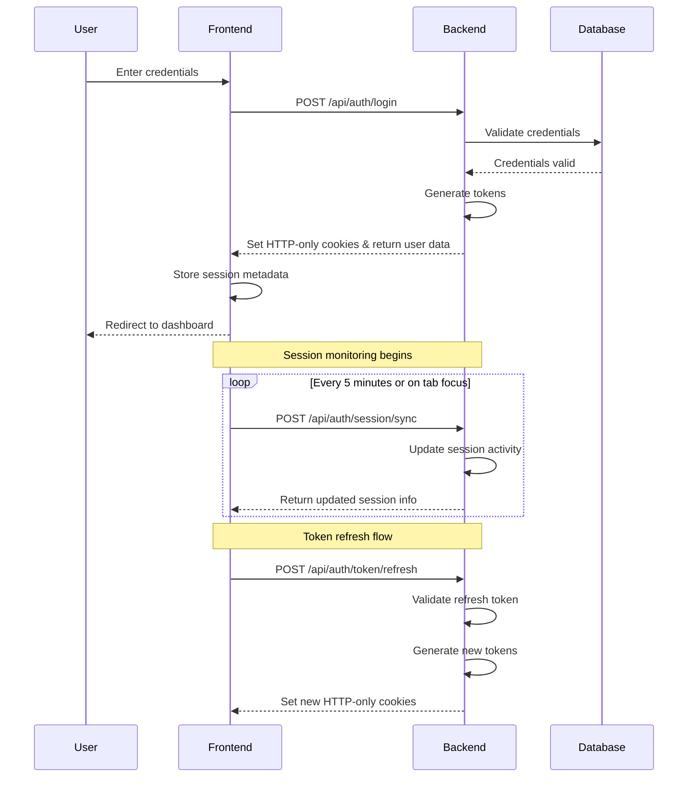

# Authentication Flow Documentation

## Overview

This document outlines the authentication flow in the application, including which endpoints require authentication and how token refresh works.

## Authentication Flow Sequence



## Endpoints Authentication Requirements

| Endpoint | Method | Authentication Required | CSRF Required |
|----------|--------|-------------------------|--------------|
| `/api/auth/login` | POST | No | No |
| `/api/auth/register` | POST | No | No |
| `/api/auth/logout` | POST | Yes | Yes |
| `/api/auth/me` | GET | Yes | No |
| `/api/auth/status` | GET | No | No |
| `/api/auth/token/refresh` | POST | Yes (refresh token) | No |
| `/api/auth/token/csrf` | GET | No | No |
| `/api/auth/session/validate` | GET | Yes | No |
| `/api/auth/session/sync` | POST | Yes | Yes |

## Token Refresh Strategy

1. **Background Refresh**: The frontend automatically refreshes tokens 5 minutes before expiry
2. **Refresh on Tab Focus**: Tokens are checked and refreshed when a tab regains focus
3. **Refresh Queue**: Multiple refresh requests are queued to prevent race conditions
4. **Refresh Failure Handling**: If refresh fails, the user is redirected to login

## Error Handling

Authentication errors follow a standard format:

```json
{
  "success": false,
  "errorCode": "ERROR_CODE",
  "message": "Human-readable error message"
}
```

Common error codes:
- `AUTH_REQUIRED`: Authentication is required
- `TOKEN_EXPIRED`: Authentication token has expired
- `INVALID_TOKEN`: Invalid authentication token
- `SESSION_EXPIRED`: Session has expired
- `CSRF_INVALID`: Invalid CSRF token